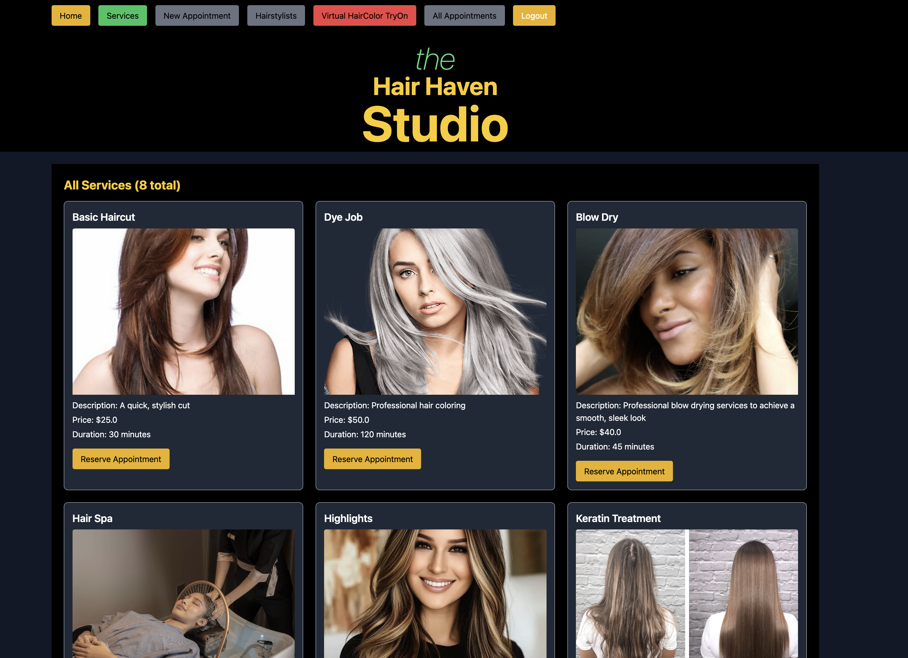
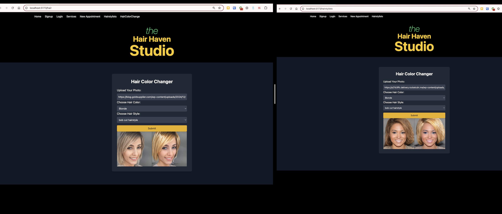
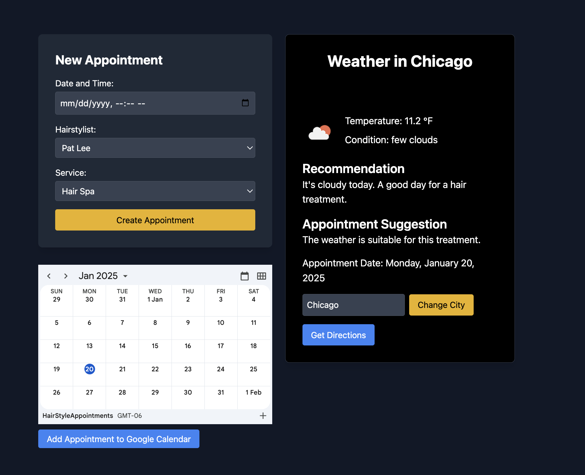
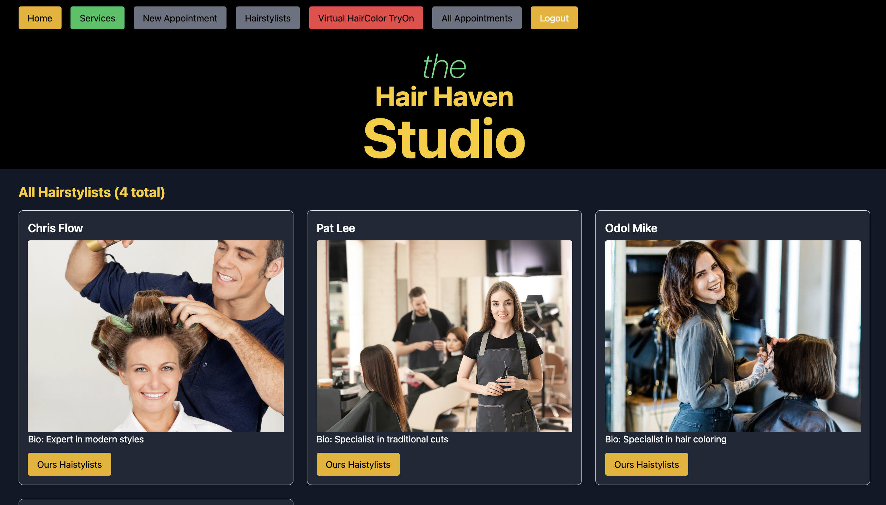

# Hair Haven Studio

A full-stack salon management system built with a Ruby on Rails API backend and a React frontend. The application provides an intuitive interface for managing salon appointments, virtual hair color try-ons, and weather-aware service recommendations.


- Other images are at the bottom of the page
- https://github.com/mkanwal-iit/hairstyle_salon_frontend_react#screenshots

[Watch the Video Presentation](YOUR_VIDEO_URL)

## Technical Stack

### Backend

- **Ruby on Rails API**: Provides RESTful JSON endpoints.
- **PostgreSQL**: Database management.
- **Authentication**: System to manage user authentication and session control.

### Frontend

- **React.js**: Utilizing Vite for fast building and hot reloading.
- **React Router**: For client-side routing.
- **Axios**: For HTTP requests.
- **Tailwind CSS**: For styling.
- **Framer Motion**: For animations.

## Key Features

### Authentication & Authorization

- Secure user signup and login system.
- Protected routes for authenticated users.
- JWT-based session management.

### Appointment Management

- Real-time appointment booking system.
- Integration with hairstylist schedules.
- Service selection and duration handling.
- Complete appointment history tracking.

### Virtual Hair Color Try-On

- AI-powered hair color simulation.
- Multiple color and style options.
- Real-time preview functionality.
- Error handling for failed transformations.

### Weather-Aware Service Recommendations

- Dynamic weather data integration.
- Personalized service suggestions based on current weather conditions.
- Location-based weather forecasting.
- Intelligent appointment scheduling recommendations.

### Interactive UI Components

- Responsive design for all screen sizes.
- Animated transitions and loading states.
- Modal-based interaction patterns.
- Form validation and error handling.

## API Endpoints

```ruby
# Services
GET /services - Returns all available salon services.

# Appointments
POST /appointments - Create a new appointment.
GET /appointments - Retrieve all appointments.

# Hairstylists
GET /hairstylists - List all hairstylists.
GET /hairstylists/:id - Get specific hairstylist details.

# Authentication
POST /users - Create a new user account.
POST /sessions - Create a new session (login).
DELETE /sessions - End a session (logout).

# Weather Integration
GET /weather/:city - Get weather data for a specific city.

# Virtual Try-On
POST /hair - Process and return virtual hair color/style.
```

## Development Setup

Clone the repository

# Frontend

git clone https://github.com/mkanwal-iit/hairstyle_salon_frontend_react-.git

- cd hairstyle_salon_frontend_react
- npm install
- npm run dev

# Backend

git clone https://github.com/mkanwal-iit/hairstyle_salon-app-.git

- cd hairstyle_salon-app
- bundle install
- rails db:create db:migrate
- rails s

### Technical Challenges Overcome

- Implemented complex state management for the virtual try-on feature.
- Developed efficient database queries for appointment scheduling.
- Created a responsive design system using Tailwind CSS.
- Integrated multiple third-party APIs seamlessly.
- Built a scalable authentication system.

### Contact

Madiha Kanwal - madiha@duck.com

## Screenshots

### Homepage


### Appointments/Services



### Hairstyle Changer



### Weather based hairstyle suggestions



### Appointments/Hairstylist



### Get Directions


### Add Appointment to Google Calendar


